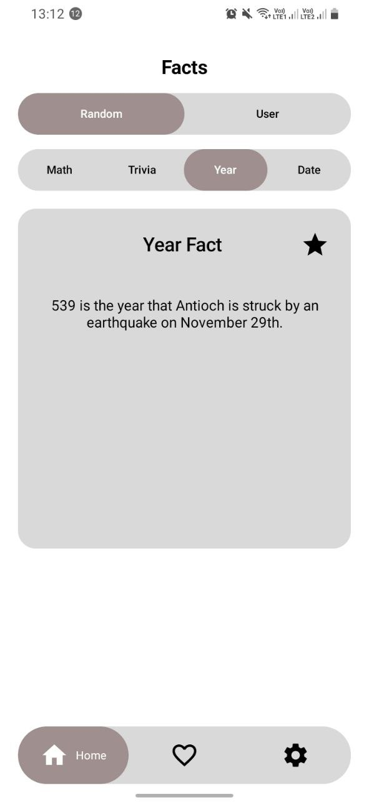
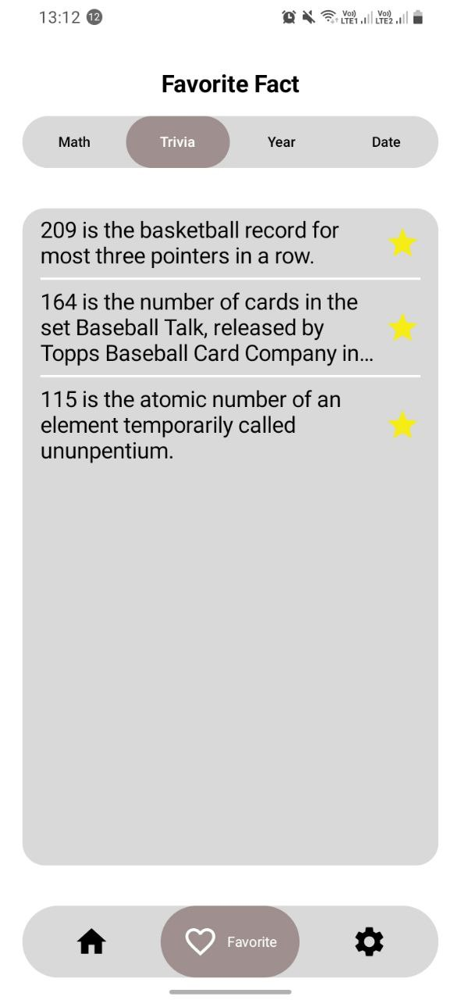
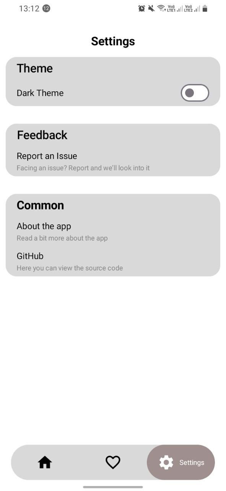
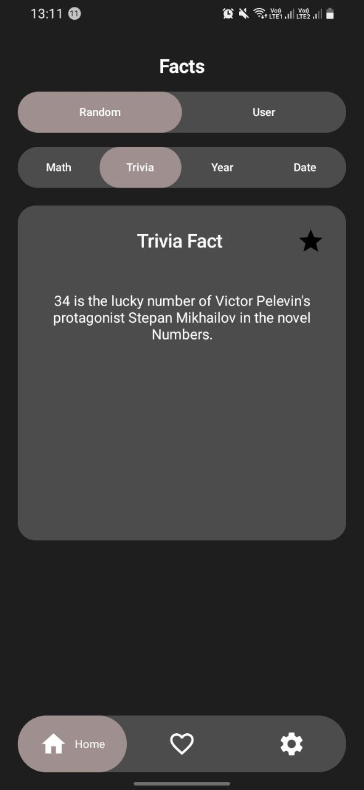
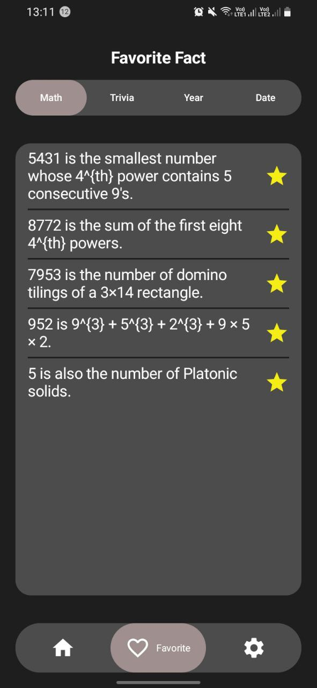
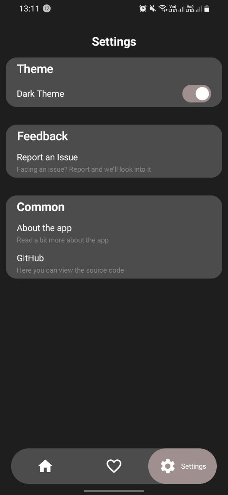

# NumFacts

Мобильное приложение, предоставляющее интересные факты о числах, датах и годах. Позволяет получать случайные факты или находить информацию о конкретных числах по выбору пользователя

## 📌 Возможности

- 🔢 Получение случайных фактов о числах
- 📅 Поиск фактов по конкретным числам, датам, годам и разные
- 💾 Сохранение понравившихся фактов в избранное
- 🌙 Поддержка светлой и темной темы
- 🔄 Разные категории фактов: математика, даты, годы, разные

## 📸 Скриншоты

### Светлая тема

  
  
  

### Темная тема

  
  
  

## 🛠 Технологии

- **Язык программирования**: Kotlin
- **UI Framework**: Jetpack Compose
- **Навигация**: Compose Navigation
- **Локальное хранилище**: 
  - Room (для избранных фактов)
  - SharedPreferences (для настроек приложения)
- **DI**: Dagger-Hilt
- **Сеть**: 
  - Retrofit2 
  - OkHttp3 
- **Асинхронность**: Kotlin Coroutines
- **API**: [Numbers API](http://numbersapi.com)
